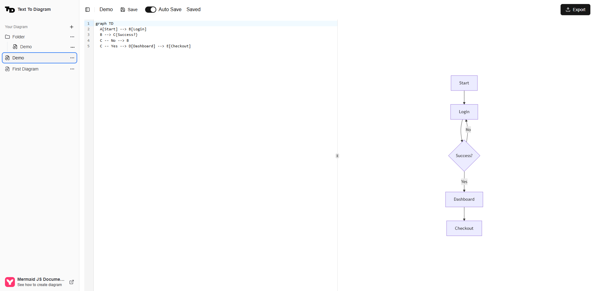

# TTD - Text To Diagram



A web-based Mermaid diagram editor that allows you to create, edit, and save diagrams using Mermaid.js syntax. Built with Next.js,

## Features

- Create and edit diagrams using Mermaid.js syntax
- Real-time diagram preview
- Responsive design for mobile and desktop
- No account required - all data stored locally

## Tech Stack

- **Framework**: Next.js 14
- **Styling**: Tailwind CSS + Shadcn UI
- **Storage**: IndexedDB
- **Diagram**: Mermaid.js
- **Language**: TypeScript

## Usage

1. Write your Mermaid syntax in the editor
2. See real-time preview of your diagram
3. Diagrams are automatically saved to your browser's IndexedDB
4. Access your diagrams anytime

## Getting Started

First, run the development server:

```bash
npm run dev
# or
yarn dev
# or
pnpm dev
# or
bun dev
```

Open [http://localhost:3000](http://localhost:3000) with your browser to see the result.

This project uses [`next/font`](https://nextjs.org/docs/app/building-your-application/optimizing/fonts) to automatically optimize and load [Geist](https://vercel.com/font), a new font family for Vercel.
